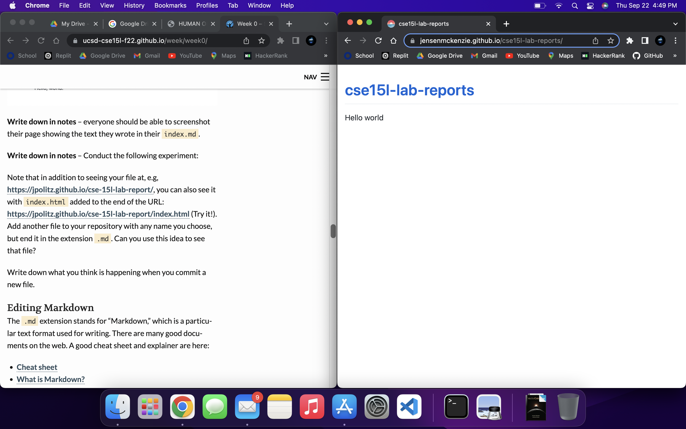
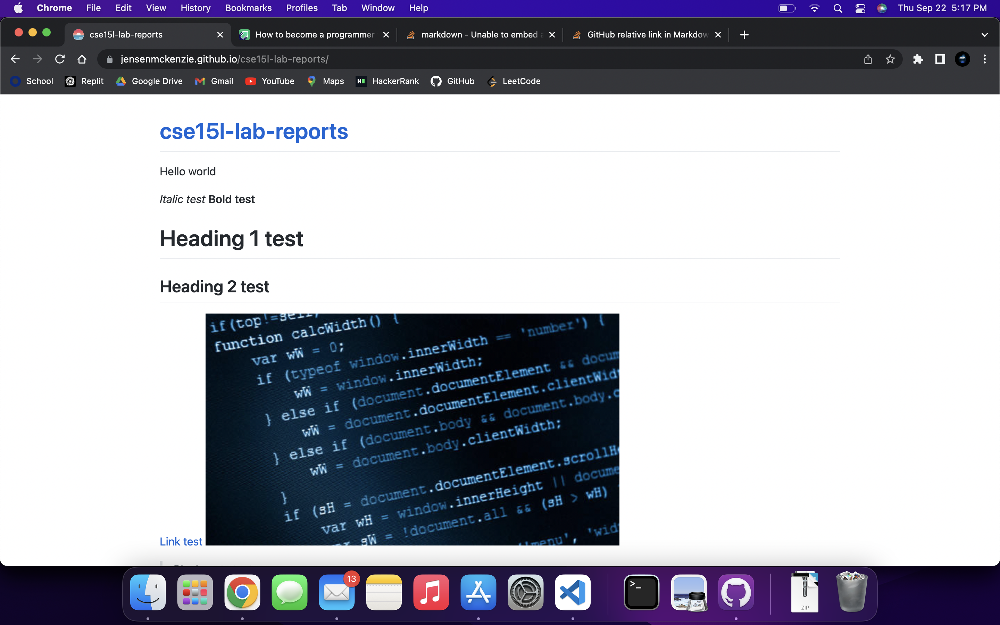

# Notes

- When you commit a new file, it is updating the website, since the website is referencing the .md file that we created in order to display an HTML webpage

[MD Test](test.md)

- When adding links, a local reference to a file will work, as well as an absolute reference to that same file, since both links will point to the same file