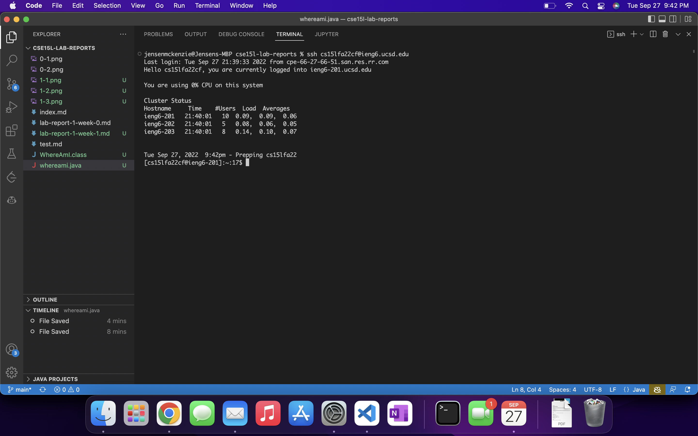

# Installing VSC
To install vscode, go to the [website](https://code.visualstudio.com) here and download it for your system, following the instructions.
It should look something like this.

# Remote connecting
If you are using windows, first install OpenSSH. Other platforms have this feature built in.
Press control or command and \` to bring up the console in VS Code.
Ensure you have set up an account with UCSD CSE department so you can ssh into your server.
Type or paste `ssh cs15lfa22XX@ieng6.ucsd.edu` into the console, replacing XX with your two unique characters.

Then enter your password for your UCSD account.

Once successfully logged in, it should look something like this.

# Commands
You are now connected to the server, and inside the server's computer.
Try some commands in the server, like `ls` or `pwd` or `cd perl5`

# Moving files with `scp`
To move files from one computer to another, use `scp <file> <destination>`. I created a file called WhereAmI.java for this example. We can copy it to a remote destination using the `scp` command, and spcifying the remote host server as the destination.

# Setting an SSH key
In order to more efficiently log into remote servers, we can define SSH keys to bypass entering passwords multiple times on approved devices.