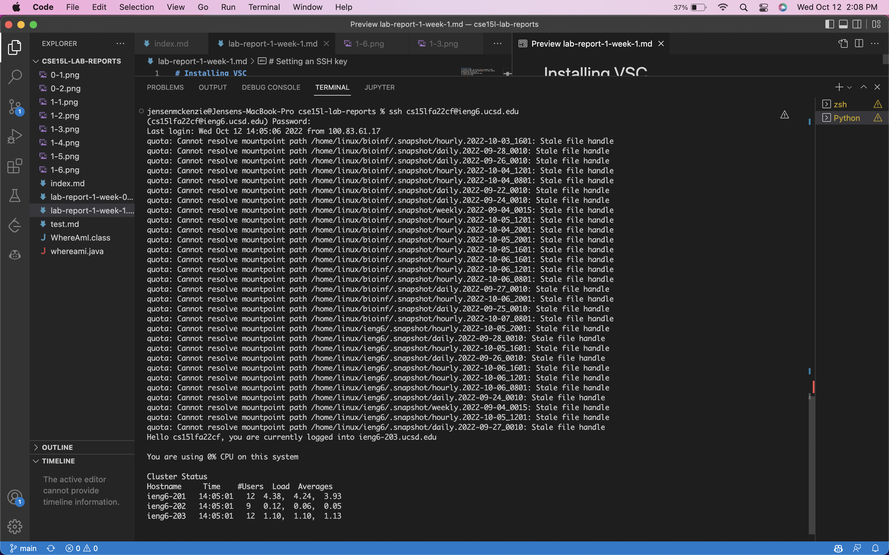
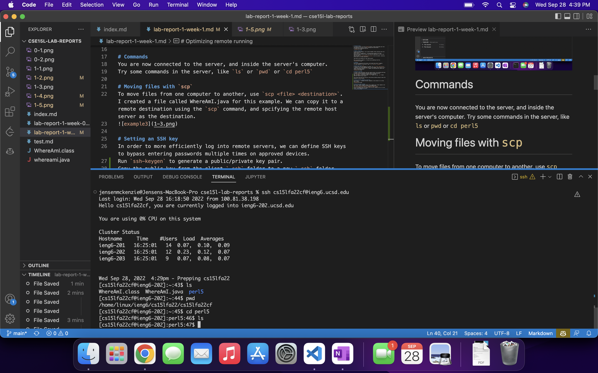
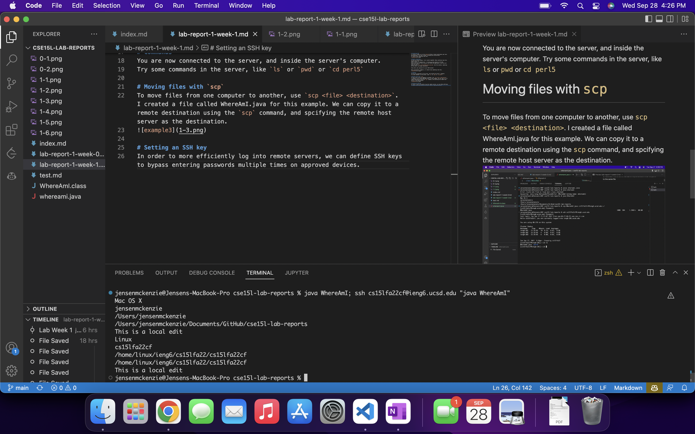

# Installing VSC
To install vscode, go to the [website](https://code.visualstudio.com) here and download it for your system, following the instructions.
It should look something like this. 

Ignore the cannot resolve errors, this was set up when there was most likely an issue with the UCSD quota system relating to ssh. 

# Remote connecting
If you are using windows, first install OpenSSH. Other platforms have this feature built in.
Press control or command and \` to bring up the console in VS Code.
Ensure you have set up an account with UCSD CSE department so you can ssh into your server.
Type or paste `ssh cs15lfa22XX@ieng6.ucsd.edu` into the console, replacing XX with your two unique characters.

Then enter your password for your UCSD account.

Once successfully logged in, it should look something like this.

# Commands
You are now connected to the server, and inside the server's computer.
Try some commands in the server, like `ls` or `pwd` or `cd perl5`

# Moving files with `scp`
To move files from one computer to another, use `scp <file> <destination>`. I created a file called WhereAmI.java for this example. We can copy it to a remote destination using the `scp` command, and spcifying the remote host server as the destination.

# Setting an SSH key
In order to more efficiently log into remote servers, we can define SSH keys to bypass entering passwords multiple times on approved devices.
Run `ssh-keygen` to generate a public/private key pair.

This shows what it should look like after running ssh-keygen.

Then log into your remote server using `ssh` and create a folder named .ssh at the root directory: `mkdir ~/.ssh`. Then logout.

Copy the public key from the client `.ssh` folder to the new `.ssh` folder that you created in your server using the following command. Make sure to replace the first directory with the path to your client side `.ssh` folder.

`scp /Users/Jensen/.ssh/id_rsa.pub cs15lfa22@ieng6.ucsd.edu:~/.ssh/authorized_keys`

For me, changing the first directory to my home directory worked as well.

`scp ~/.ssh/id_rsa.pub cs15lfa22@ieng6.ucsd.edu:~/.ssh/authorized_keys`

This pictures shows what it should look like logging in after copying the public key over to the server, after you create the .ssh directory.

You can now log into ssh from your client device without having to enter the password for each session.

# Running multiple commands in one line
You can put a `;` between different commands in the terminal to run them back to back.

# Optimizing remote running
You can run remote commands without fully logging your client computer into your server. This is done by using the following sytax:
`ssh <username>@<server-address> "COMMAND YOU WANT TO RUN"`
Place the command within the quotes after the ssh command to run it in your server, then immediately log out.
