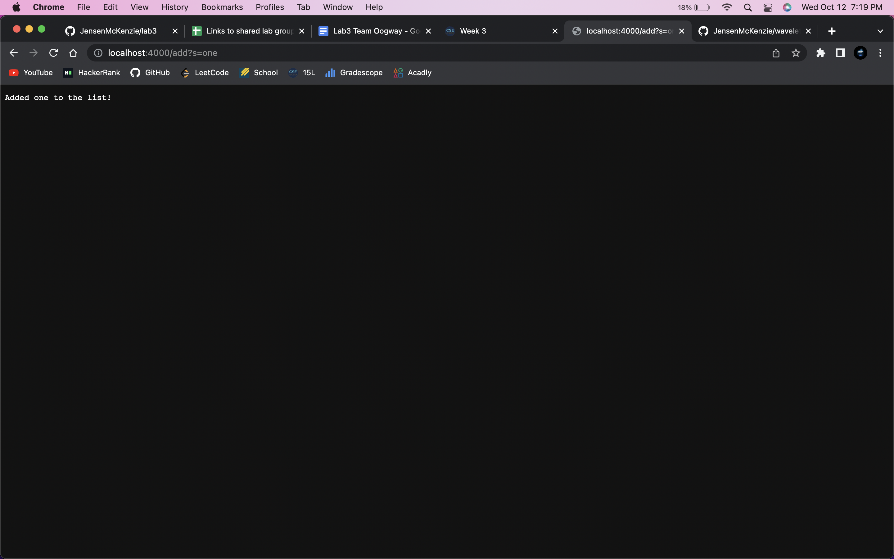

# Part 1

## Code
```
import java.io.IOException;
import java.net.URI;
import java.util.ArrayList;

class Handler implements URLHandler{
    ArrayList<String> list = new ArrayList<String>();

    public String handleRequest(URI url){
        if (url.getPath().equals("/")){
            String result = "";
            for (String s : list){
                if (result.equals("")){
                    result = s;
                } else {
                    result += ", " + s;
                }
            }
            return (result.equals("") ? "No items in list" : "List: " + result);
        }
        else if (url.getPath().equals("/add")) {
            String [] parameters = url.getQuery().split("=");
            if (parameters[0].equals("s")){
                list.add(parameters[1]);
                return "Added " + parameters[1] + " to the list!";
            }
            else{
                return "Incorrect query parameter!";
            }
        }
        else if (url.getPath().equals("/search")){
            String [] parameters = url.getQuery().split("=");
            if (parameters[0].equals("s")){
                String result = "";
                for (String s : list){
                    if (s.contains(parameters[1])){
                        if (result.equals("")){
                            result = s;
                        }
                        else{
                            result += ", " + s;
                        }
                    }
                }
                return (result.equals("") ? "No results found!" : "Found in list: {" + result + "} containing the query \"" + parameters[1] + "\"");
            }else{
                return "Incorrect query parameter!";
            }
        }
        else{
            return "404 Not Found!";
        }
    }
}

class SearchEngine {
    public static void main(String[] args) throws IOException {
        if(args.length == 0){
            System.out.println("Missing port number! Try any number between 1024 to 49151");
            return;
        }

        int port = Integer.parseInt(args[0]);

        Server.start(port, new Handler());
    }
}
```

## Server with no items in list

The handleRequest method is called, which first calls the getPath method on the url to see if the path is equal to /. In this case, the path is /.


We then loop through the list, adding all elements to a result variable. We return this result variable if the list is not empty, in which case we say that the list is empty.

The result variable is changing here as we add the various elements from the list to it.

## Adding a new element

The handleRequest method is called, which first checks the path. The path is equal to /add in this case, so we enter that if statement.

The value of the path is currently /add, and the value of the query is currently an array, `["s", "one"]`. This array stores the query variable, in this case "s," at index 0. And the query value, in this case "one," at index 1.

The list variable is changed only if the query varaible is equal to "s". Otherwise we return an error message. If the user supplies "s" as the query variable, we add the query value to the list. We also use a result variable to track the output.

## Searching for a query

The handleRequest method is called, which first checks the path. The path is equal to /search in this case, so we enter that if statement.

The value of the path is currently /search, and the value of the query is currently an array, `["s", "one"]`. We check to make sure the item at index 0, the query variable name, is equal to "search". 

If the query is "search", we loop through the list looking for an element that contains the query value. We do not modify any variables other than the result, which is a string meant to track the output.

# Part 2

## Files: ArrayExamples.java, ArrayTests.java

## Failure inducing input
```
@Test
public void testReverseInPlaceLength5() {
    int[] input1 = { 1, 2, 3, 4, 5 };
    ArrayExamples.reverseInPlace(input1);
    assertArrayEquals(new int[] { 5, 4, 3, 2, 1 }, input1);
}
```

## Symptom
```
JUnit version 4.13.2
.....E
Time: 0.019
There was 1 failure:
1) testReverseInPlaceLength5(ArrayTests)
arrays first differed at element [3]; expected:<2> but was:<4>
        at org.junit.internal.ComparisonCriteria.arrayEquals(ComparisonCriteria.java:78)
        at org.junit.internal.ComparisonCriteria.arrayEquals(ComparisonCriteria.java:28)
        at org.junit.Assert.internalArrayEquals(Assert.java:534)
        at org.junit.Assert.assertArrayEquals(Assert.java:418)
        at org.junit.Assert.assertArrayEquals(Assert.java:429)
        at ArrayTests.testReverseInPlaceLength5(ArrayTests.java:19)
        ... 32 trimmed
Caused by: java.lang.AssertionError: expected:<2> but was:<4>
        at org.junit.Assert.fail(Assert.java:89)
        at org.junit.Assert.failNotEquals(Assert.java:835)
        at org.junit.Assert.assertEquals(Assert.java:120)
        at org.junit.Assert.assertEquals(Assert.java:146)
        at org.junit.internal.ExactComparisonCriteria.assertElementsEqual(ExactComparisonCriteria.java:8)
        at org.junit.internal.ComparisonCriteria.arrayEquals(ComparisonCriteria.java:76)
        ... 38 more

FAILURES!!!
Tests run: 5,  Failures: 1
```

## Bug
Change the method from:
```
for(int i = 0; i < arr.length; i += 1) {
      arr[i] = arr[arr.length - i - 1];
}
```
To:
```
for(int i = 0; i < arr.length/2; i += 1) {
    int temp = arr[i];
    arr[i] = arr[arr.length - i - 1];
    arr[arr.length -i -1] = temp;
}
```
## Connection between symptom and bug

The output was telling us that at element 3, we expected 2, but got 4. At this point, the array was `[5,4,3,4,5]`, because we did not actually swap any values, we just set one side of the array to the other side. To fix this, we store the current value in a temp variable, change the value at the current index, then change the value at index `arr.length - i -1` to the temp variable. Also, we only need to loop through half of the array, so we set the for loop condition to `i < arr.length/2`

---


## Files: ListExamples.java, ListTests,java

## Failure inducing input
```
@Test
public void testMerge(){
    List<String> input1 = new ArrayList<String>(Arrays.asList("test"));
    List<String> input2 = new ArrayList<String>(Arrays.asList("test2"));
    List<String> result1 = ListExamples.merge(input1, input2);
    List<String> expected1 = new ArrayList<String>(Arrays.asList("test", "test2"));
    assertEquals(expected1.size(), result1.size());
    for (int i = 0; i < result1.size() -1 ; i++){
        assertEquals(expected1.get(i), result1.get(i));
    }
}
```

## Symptom
This shows that we have an infinite loop
```
JUnit version 4.13.2
.
```
## Bug
Change the last while loop in the merge method from:
```
while(index2 < list2.size()) {
    result.add(list2.get(index2));
    index1 += 1;
}
```
To:
```
while(index2 < list2.size()) {
    result.add(list2.get(index2));
    index2 += 1;
}
```
## Connection between symptom and bug

We are looping through list2, using the varible index2 both as a reference to an index in that list, and as a stopping mechanism for the loop. However, we are incrementing index1 instead if index2, which will cause the loop to never terminate.