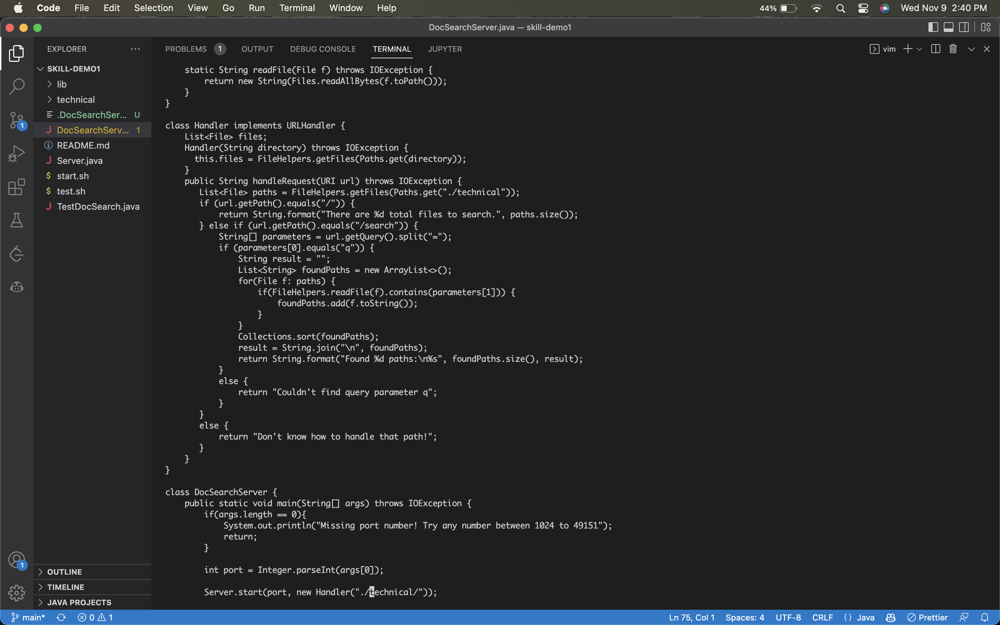

# Part 1
Question: In DocSearchServer.java, change the main method so that rather than hardcoding the search on the ./technical directory, it uses the second command-line argument for the path to search

VIM Commands (29 keys): 
```
/tec
<Enter>
n
ce
<Esc>
hh
xxxxx
i
args[1]
<Esc>
:wq
<Enter>
```

1:
```
/tec
n
```
The first command searches for occurrences of the string "tec", then we cycle to the 2nd occurrence with n.


2:
```
ce
```
This deletes the current word.


3:
```
<Esc>
hh
xxxxx
```
This puts us in normal mode, and removes all arguments passed to the Handler function.


4:
```
i
args[1]
```
This puts us in insert mode, and adds the argument "args[1]" to the Handler method.


---

# Part 2

1. Editing file client side: 1:49

While everything editing-wise went smoothly, copying the file into the remote server, verifying its existence, and actually running it on the remote server took most of the time here. So even though I saved time by using VSCode as my editor, I definately lost time overall because of how long the second part of this process took.

2. Editing file server side 1:35

Editing the file was a bit clunky, since I'm not really used to using VIM yet. However, I can definately see how, with a bit of time, I would be able to make this option must faster than the first one.

## Conclusion

Overall, I still prefer using VSCode to edit things. The extensions, intuitive nature, and my overall comfort level definately factor into this opinion.
However, I will preface this with the fact that if I am making a small edit or bug corrections, it may be better to use VIM. This is because editing a file on the server side has many time advantages as long as you are comfortable with the editor. So I think the smaller the task, the more likely I would be to use VIM. However, on any large scale project, I will still always use VSCode.