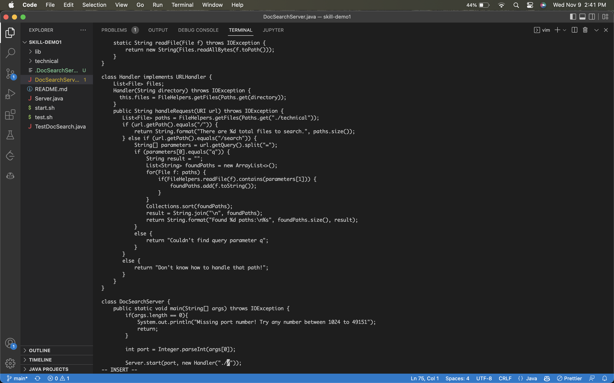
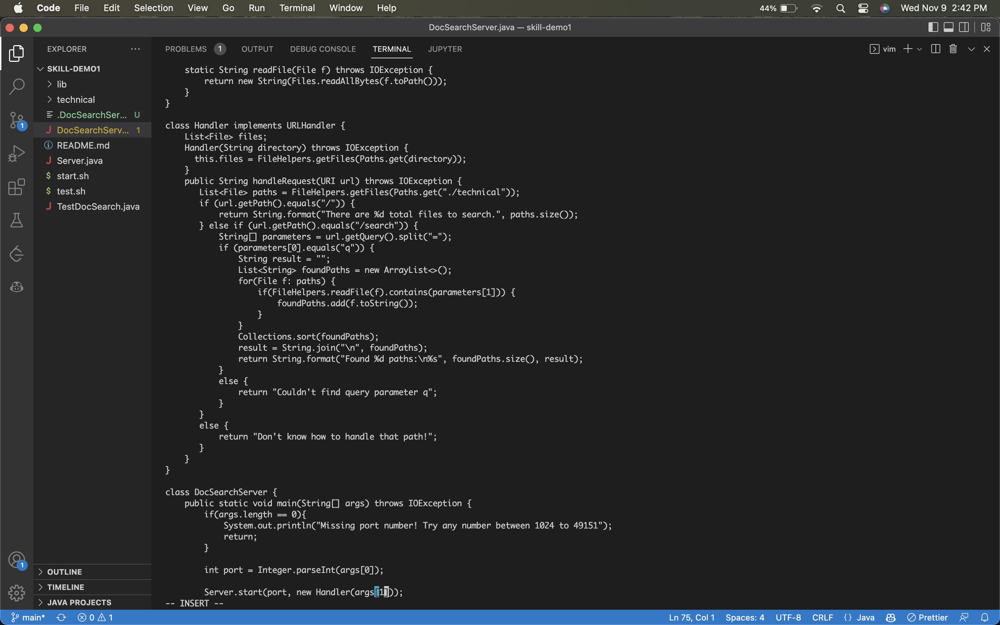

# Part 1
Question: In DocSearchServer.java, change the main method so that rather than hardcoding the search on the ./technical directory, it uses the second command-line argument for the path to search

VIM Commands (29 keys): 
```
/tec
<Enter>
n
ce
<Esc>
hh
xxxxx
i
args[1]
<Esc>
:wq
<Enter>
```

1:
```
/tec
n
```
The first command searches for occurrences of the string "tec", then we cycle to the 2nd occurrence with n.


2:
```
ce
```
This deletes the current word.


3:
```
<Esc>
hh
xxxxx
```
This puts us in normal mode, and removes all arguments passed to the Handler function.


4:
```
i
args[1]
```
This puts us in insert mode, and adds the argument "args[1]" to the Handler method.


---

# Part 2