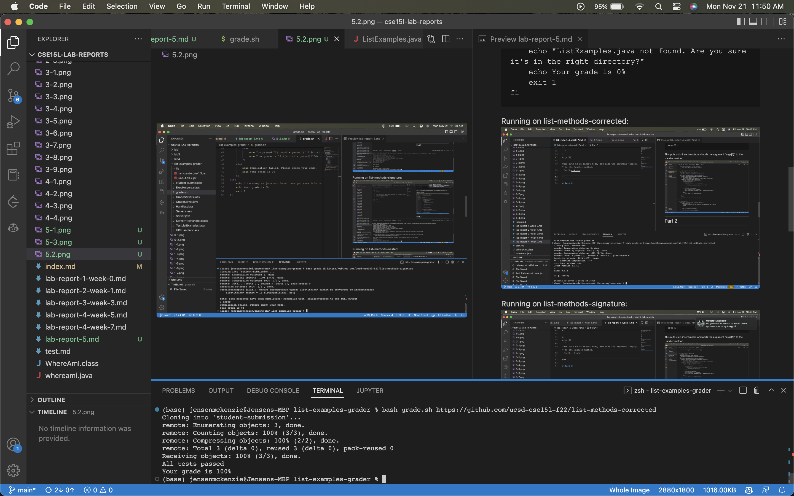
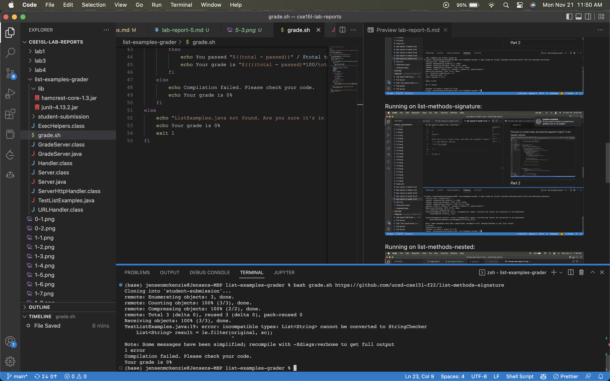
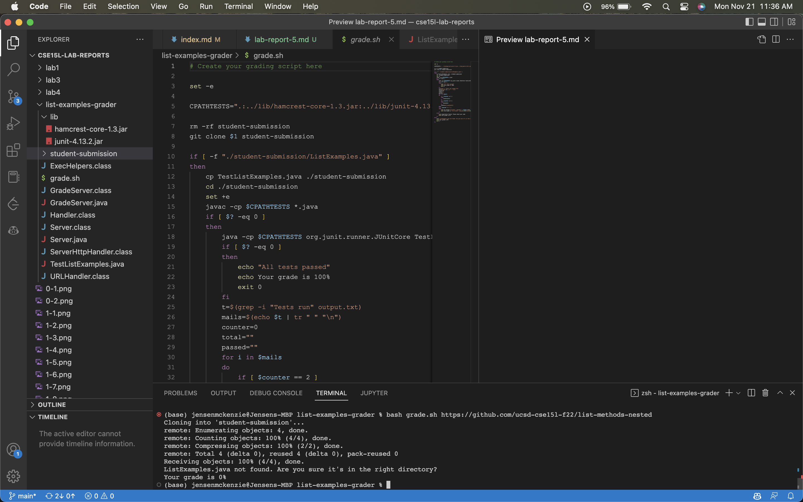

```
grade.sh:

set -e

CPATHTESTS=".:../lib/hamcrest-core-1.3.jar:../lib/junit-4.13.2.jar"

rm -rf student-submission
git clone $1 student-submission

if [ -f "./student-submission/ListExamples.java" ]
then
    cp TestListExamples.java ./student-submission
    cd ./student-submission
    set +e
    javac -cp $CPATHTESTS *.java
    if [ $? -eq 0 ]
    then
        java -cp $CPATHTESTS org.junit.runner.JUnitCore TestListExamples > output.txt
        if [ $? -eq 0 ]
        then
            echo "All tests passed"
            echo Your grade is 100%
            exit 0
        fi
        t=$(grep -i "Tests run" output.txt)
        elements=$(echo $t | tr " " "\n")
        counter=0
        total=""
        passed=""
        for i in $elements
        do
            if [ $counter == 2 ]
            then
                total=${i%?}
            fi
            if [ $counter == 4 ]
            then
                passed=$i
            fi
            counter=$((counter+1))
        done
        if [ "$passed" != "" ]
        then
            echo You passed "$((total - passed))" / $total tests
            echo Your grade is "$((((total - passed)*100/total*100)/100))"%
        fi
    else
        echo Compilation failed. Please check your code.
        echo Your grade is 0%
    fi
else
    echo "ListExamples.java not found. Are you sure it's in the right directory?"
    echo Your grade is 0%
    exit 1
fi
```

Running on list-methods-corrected:


Running on list-methods-signature:


Running on list-methods-nested:


Tracing list-methods-nested:
This repository has the correct code, but it is nested inside another folder, not in the expected location.

```
set -e

CPATHTESTS=".:../lib/hamcrest-core-1.3.jar:../lib/junit-4.13.2.jar"

rm -rf student-submission
git clone $1 student-submission
```

Here all of these commands have no errors. The first 4 lines have no standard output, the last line has output, which represents the git cloning process. They all return a value of 0.

```
if [ -f "./student-submission/ListExamples.java" ]
then
    cp TestListExamples.java ./student-submission
    cd ./student-submission
    set +e
    javac -cp $CPATHTESTS *.java
    if [ $? -eq 0 ]
    then
        java -cp $CPATHTESTS org.junit.runner.JUnitCore TestListExamples > output.txt
        if [ $? -eq 0 ]
        then
            echo "All tests passed"
            echo Your grade is 100%
            exit 0
        fi
        t=$(grep -i "Tests run" output.txt)
        elements=$(echo $t | tr " " "\n")
        counter=0
        total=""
        passed=""
        for i in $elements
        do
            if [ $counter == 2 ]
            then
                total=${i%?}
            fi
            if [ $counter == 4 ]
            then
                passed=$i
            fi
            counter=$((counter+1))
        done
        if [ "$passed" != "" ]
        then
            echo You passed "$((total - passed))" / $total tests
            echo Your grade is "$((((total - passed)*100/total*100)/100))"%
        fi
    else
        echo Compilation failed. Please check your code.
        echo Your grade is 0%
    fi
```

Everything in this if block does not run, because the condition is not met. The script looks for the file inside of the main repository directory, but does not find it. So, it moves on to the else block.

```
else
    echo "ListExamples.java not found. Are you sure it's in the right directory?"
    echo Your grade is 0%
    exit 1
fi
```

This else block is executed because the ListExamples.java file is not found in the main directory. 
The first 2 commands execute with standard output specified in each line. They do not have any standard error messages. They return a value of 0 to indicated success. 

The last line terminates the script with an error code/return value of 1. This indicated there was a problem somewhere in the script and all tests were not passed.